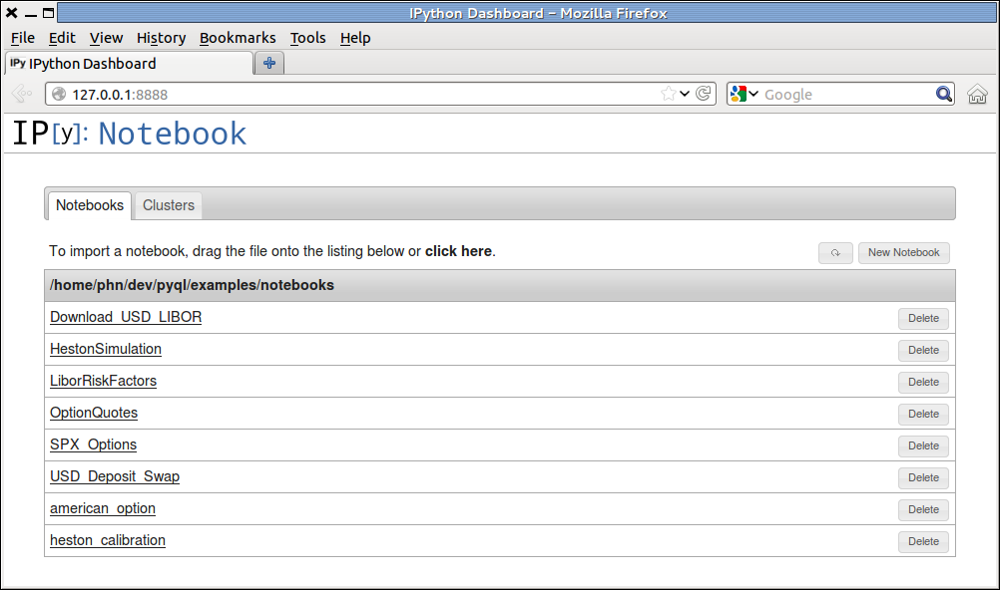

Notebooks
=========

The notebooks and scripts folder provide sample calculations performed with
QuantLib. 

Getting started
---------------

In order to use the notebokks, you need to install:

* Ipython 0.13
* pylab
* matplotlib

Make sure that pyQL is in the PYTHONPATH. 
You can access the notebooks with the command:

.. code-block:: bash
   
   ipython notebook --pylab inline <path to the notebooks folder> --browser=<browser name>
   
   
For example, on a linux system where the pyql project is located in ~/dev, the command to view the notebooks with the Firefox browser would be:

.. code-block:: bash
   
   ipython notebook --pylab inline ~/dev/pyql/examples/notebooks  --browser=firefox
   
   
The browser will start and display a menu with several notebooks.
As of October 2012, you should see 8 notebooks, as shown below:

   
   Notebook menu in the Firefox browser.

